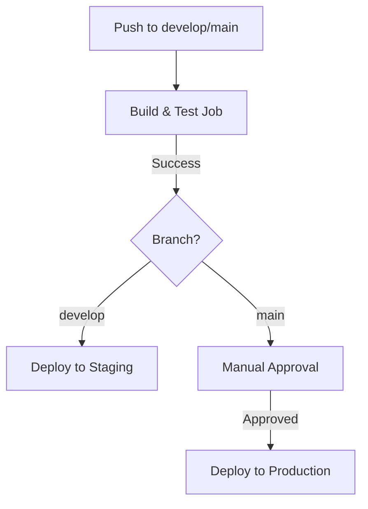

# FLRVI - CI/CD Pipeline Specification

**Objective:** This document provides a detailed specification for the Continuous Integration and Continuous Deployment (CI/CD) pipelines for the FLRVI project.

### 1. Overview

We will use **GitHub Actions** to automate our CI/CD processes. We will have two separate pipelines: one for the backend and one for the mobile application.

### 2. Backend CI/CD Pipeline

*   **Trigger:** On every push to the `main` or `develop` branches, and on every pull request targeting these branches.
*   **Workflow File:** `.github/workflows/backend.yml`

**Jobs & Steps:**

1.  **`build_and_test` Job:**
    *   **Runner:** `ubuntu-latest`
    *   **Steps:**
        1.  **Checkout Code:** `actions/checkout@v4`
        2.  **Setup Node.js:** `actions/setup-node@v4` with the specified Node.js version (e.g., 18.x).
        3.  **Install Dependencies:** Run `npm ci` in the `backend` directory to install dependencies from the lockfile.
        4.  **Lint & Format Check:** Run `npm run lint` and `npm run format:check` to ensure code quality and consistency.
        5.  **Run Unit & Integration Tests:** Run `npm test` to execute the full test suite.
        6.  **Build Docker Image:** Build a Docker image of the backend application.
        7.  **Push Docker Image:** Push the Docker image to a container registry (e.g., Docker Hub, AWS ECR).

2.  **`deploy_staging` Job:**
    *   **Condition:** Runs only on a successful push to the `develop` branch.
    *   **Needs:** `build_and_test`
    *   **Steps:**
        1.  **Deploy to Staging:** Use the Docker image from the previous job to deploy the application to a staging environment (e.g., a staging Heroku app or AWS Elastic Beanstalk environment).

3.  **`deploy_production` Job:**
    *   **Condition:** Runs only on a successful push to the `main` branch.
    *   **Needs:** `build_and_test`
    *   **Environment:** Requires a manual approval step for production deployment.
    *   **Steps:**
        1.  **Deploy to Production:** Use the Docker image to deploy the application to the production environment.

**Flowchart:**

### 3. Mobile App CI/CD Pipeline (React Native)

*   **Trigger:** On every push to the `main` or `develop` branches.
*   **Workflow File:** `.github/workflows/mobile.yml`

**Jobs & Steps:**

1.  **`build_and_test_android` Job:**
    *   **Runner:** `macos-latest`
    *   **Steps:**
        1.  **Checkout Code:** `actions/checkout@v4`
        2.  **Setup Java & Node.js:** Set up the required Java and Node.js versions.
        3.  **Setup React Native:** Install the React Native CLI.
        4.  **Install Dependencies:** Run `npm ci` in the `mobile/flrvi_app` directory.
        5.  **Run Tests:** Run `npm test`.
        6.  **Build Android App (APK/AAB):** Build the release version of the Android application.
        7.  **Upload Artifact:** Upload the generated APK/AAB file as a build artifact.

2.  **`build_and_test_ios` Job:**
    *   **Runner:** `macos-latest`
    *   **Steps:**
        1.  **Checkout Code:** `actions/checkout@v4`
        2.  **Setup Xcode:** Select the required Xcode version.
        3.  **Install Dependencies:** Run `npm ci` and `cd ios && pod install`.
        4.  **Run Tests:** Run `npm test`.
        5.  **Build iOS App (.ipa):** Build the release version of the iOS application.
        6.  **Upload Artifact:** Upload the generated .ipa file as a build artifact.

3.  **`deploy_internal_testing` Job:**
    *   **Condition:** Runs only on a successful push to the `develop` branch.
    *   **Needs:** `build_and_test_android`, `build_and_test_ios`
    *   **Steps:**
        1.  **Deploy to TestFlight (iOS):** Automatically upload the .ipa file to TestFlight for internal testing.
        2.  **Deploy to Google Play Internal Testing (Android):** Automatically upload the AAB file to the internal testing track on the Google Play Console.

This detailed CI/CD plan ensures that our development process is automated, reliable, and follows modern best practices.
