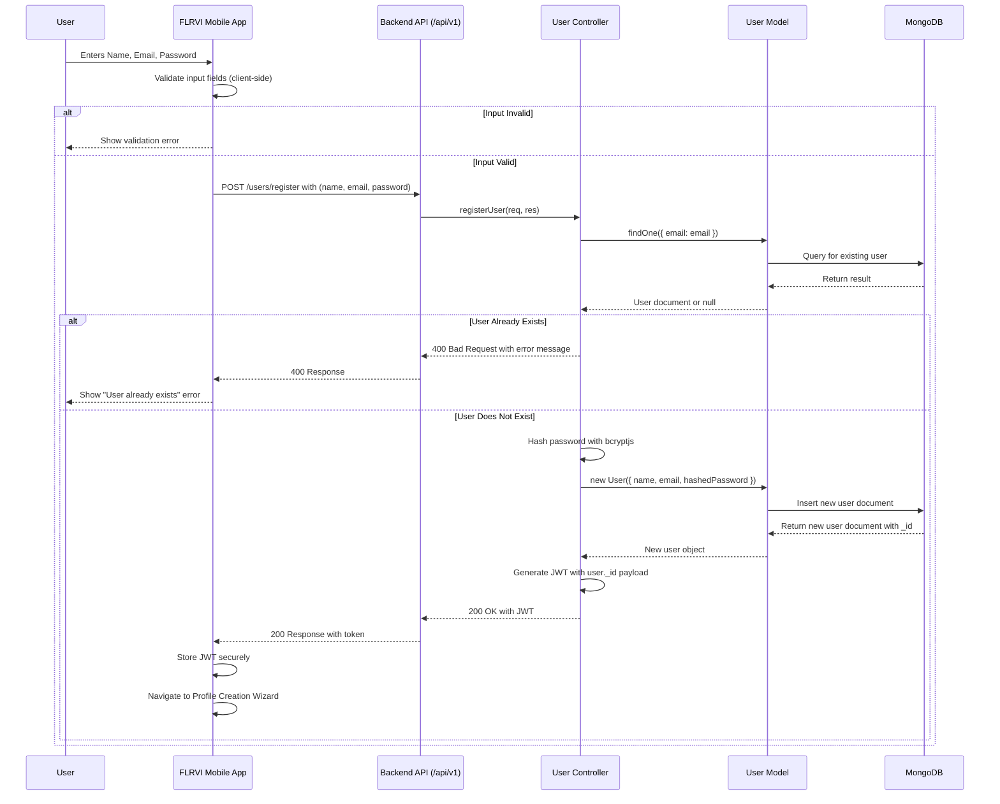

# FLRVI - Data Flow Diagrams (DFDs)

**Objective:** This document provides detailed diagrams illustrating how data flows through the FLRVI system for key user actions. It is intended to give developers a clear, end-to-end understanding of the system's logic.

---

## 1. User Registration Data Flow

**Description:** This diagram illustrates the sequence of events and data transformations that occur when a new user registers for an account.

**Flowchart:**

### **Data Transformation Details:**

*   **Password Hashing:** The `password` field sent from the client is never stored in plain text. The `UserController` uses the `bcryptjs` library to generate a salt and hash the password before it is saved to the database.
*   **JWT Payload:** The JSON Web Token generated upon successful registration contains a payload with the new user's MongoDB `_id`. This allows the backend to identify the user in subsequent authenticated requests.

---

## 2. Subscription Purchase Data Flow

**Description:** This diagram illustrates the flow of data when a user purchases a premium subscription.

**Flowchart:**

### **Data Transformation Details:**

*   **Omise Token:** The client-side Omise SDK handles the complexities of the Thai QR payment flow and returns a single-use `source` token to the mobile app. This token is securely sent to our backend.
*   **Customer & Subscription Creation:** Our backend uses the `source` token to create a `Customer` object in Omise. This customer is then associated with a recurring `Subscription`. This two-step process is a best practice for managing subscriptions.
*   **Local Record:** We store the `omiseCustomerId` and `omiseSubscriptionId` in our own database. This allows us to manage the subscription (e.g., check its status, cancel it) without needing to store sensitive payment details.

---

## 3. Real-Time Messaging Data Flow

**Description:** This diagram illustrates the flow of data when a user sends or receives a message in real-time.

**Flowchart:**

### **Technical Details:**

*   **Hybrid Approach:** We use a hybrid approach for messaging. The initial message is sent via a standard `POST` request to the REST API. This ensures that the message is persisted to the database and allows for standard error handling.
*   **Real-Time Delivery:** After the message is saved, the backend emits an event to a **WebSocket Server**. The WebSocket server is responsible for pushing the new message in real-time to the recipient's device.
*   **Client-Side State:** When the recipient's app receives the `newMessage` event, it updates its local Redux store, which causes the UI to re-render and display the new message instantly.

---
