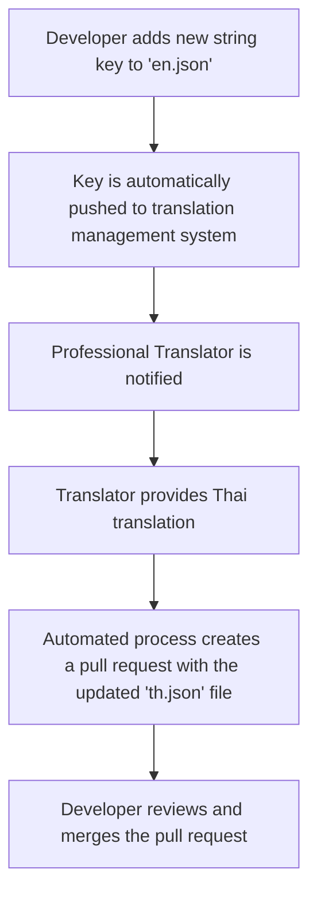

# FLRVI - Localization & Internationalization (i18n) Strategy

**Version:** 1.0
**Date:** 2025-08-09

**Objective:** This document outlines the comprehensive strategy for localizing the FLRVI application for different languages and regions, with an initial focus on English and Thai.

---

## 1. Guiding Principles

*   **Global First:** The application will be built with internationalization in mind from the ground up. All user-facing strings will be externalized from the code.
*   **Cultural Nuance:** Translations will be culturally appropriate and natural-sounding, not just literal word-for-word translations.
*   **Scalable Process:** The process for adding new languages will be simple and scalable.

---

## 2. Technical Implementation

### 2.1. Backend (Node.js)
*   **Library:** `i18next` with `i18next-http-middleware`.
*   **Language Detection:** The user's preferred language will be detected from the `Accept-Language` header of incoming API requests.
*   **Translation Files:** Language resources will be stored in JSON format in the `backend/locales/` directory (e.g., `en.json`, `th.json`).
*   **Usage:** All API responses (errors, success messages) will use the `req.t()` function to provide translated content.

### 2.2. Mobile App (React Native)
*   **Library:** `react-i18next`.
*   **Language Detection:** The app will default to the device's language. Users will also be able to manually select their preferred language in the settings.
*   **Translation Files:** Language resources will be stored in JSON format within the mobile app's assets (`/src/locales/`).
*   **Usage:** All UI text will be rendered using the `useTranslation` hook.

### 2.3. Date, Time, and Number Formatting
*   We will use the `Intl` API (built into modern JavaScript environments) to format dates, times, and numbers according to the user's locale. This ensures that formats like `DD/MM/YYYY` vs. `MM/DD/YYYY` are handled correctly.

---

## 3. Translation Management Workflow

This workflow ensures that translations are high-quality and can be managed efficiently.

**Flowchart:**

*   **Translation Management System:** We will use a platform like [Lokalise](https://lokalise.com/) or [Phrase](https://www.phrase.com/). These platforms integrate with GitHub to automate the process of extracting new keys and submitting new translations.
*   **Source of Truth:** The `en.json` file in the backend repository will be the single source of truth for all strings in the application.
*   **Professional Translators:** We will hire professional translators who are native Thai speakers to ensure high-quality, culturally appropriate translations.

---

## 4. Pluralization & Gender

*   **Pluralization:** `i18next` has built-in support for pluralization, which we will use to handle strings that change based on a number (e.g., "1 new message" vs. "2 new messages").
*   **Gender:** For languages that have grammatical gender, `i18next`'s context feature will be used to provide gender-specific translations where necessary.

This comprehensive localization strategy will ensure that FLRVI feels like a native application for our users in Thailand and provides a solid foundation for future expansion into other markets.
