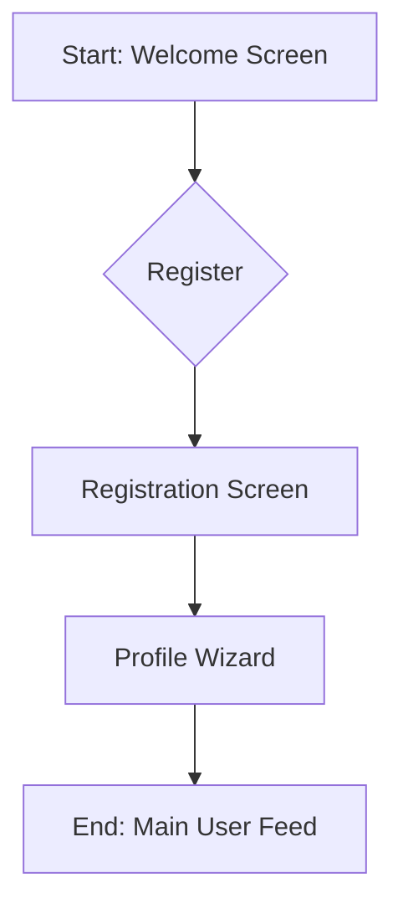
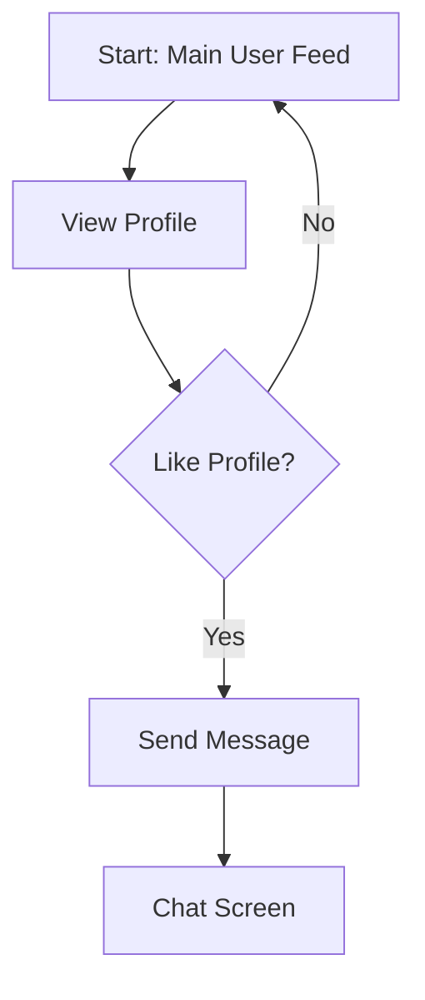

# FLRVI - The Definitive Product Requirements Document (PRD)

**Version:** 16.0 (Master Document with Full Documentation Suite & Hyper-Detailed Screen & Component Definitions)
**Date:** 2025-08-09

**Objective:** This document is the single, comprehensive source of truth for the FLRVI project. It consolidates all strategic, product, technical, and operational planning into one master guide, and is supplemented by a complete suite of hyper-detailed JSON definitions for each screen and reusable component.

---

## **Part 1: Product & Strategy**

### 1.1. Introduction & Vision
*   **Project Name:** FLRVI
*   **Vision:** To become the leading dating app in Thailand, known for its high-quality user base, modern user experience, and commitment to fostering genuine relationships.
*   **Problem Statement:** The current dating app market in Thailand presents several challenges for users. Many platforms have outdated interfaces, confusing user experiences, and are populated with inactive or non-genuine profiles. This makes it difficult and frustrating for users to find meaningful connections. FLRVI will solve this by providing a seamless, engaging, and secure platform.

### 1.2. Target Audience
*   **Primary Audience:** Tech-savvy individuals aged 20-45 in Thailand, including both Thai nationals and expatriates.
*   **User Personas:**
    *   **"Nok," the University Student (22):** Looking for casual dating and new friendships. Values a fun, modern UI and the ability to filter by proximity and interests.
    *   **"Alex," the Expat Professional (35):** Seeking a serious relationship. Values detailed profiles, advanced search filters, and a secure platform to avoid scams.

---

## **Part 2: Features & User Experience**

### 2.1. Core Features (MVP)
This section provides a high-level overview of the core features. For a hyper-detailed, component-level breakdown of each screen, its UI, state management, and API calls, please refer to the JSON files in the `docs/app_screens_json/`, `docs/web_screens_json/`, and `docs/components_json/` directories.

*   **User Onboarding:** A seamless registration and profile creation flow.
*   **Profile Management:** Comprehensive tools for users to manage their profiles.
*   **Discovery & Search:** An intuitive interface for browsing and filtering potential matches.
*   **Interaction & Communication:** A real-time messaging system.
*   **Monetization:** A premium subscription model with clear value.

### 2.2. User Journeys & Flowcharts
#### 2.2.1. Onboarding Journey

#### 2.2.2. Core Interaction Journey

### 2.3. UI/UX Guidelines
*   **Design Philosophy:** Modern, clean, user-centric, and engaging.
*   **Color Palette:** Primary: `#E91E63` (Pink), Secondary: `#FF9800` (Orange).
*   **Typography:** `Poppins` font family.

---

## **Part 3: Technical Specifications**

### 3.1. System Architecture
*   **Backend:** MERN Stack (Node.js, Express.js, MongoDB). Stateless, MVC architecture.
*   **Mobile App:** React Native with TypeScript.
*   **Database:** MongoDB with Mongoose.
*   **Core Algorithm (User Matching):** A combination of user-defined filters and recency, with plans for a more advanced algorithm post-MVP.

### 3.2. Mobile App Architecture
*   **State Management:** Redux Toolkit.
*   **API Communication:** Axios.
*   **Navigation:** React Navigation.
*   **Folder Structure:** A modular structure with clear separation of concerns (`/api`, `/components`, `/screens`, `/store`, etc.).

### 3.3. API Specification (v1)
*   **`POST /api/v1/users/register`**: Register a new user.
*   **`POST /api/v1/users/login`**: Login an existing user.
*   **`GET /api/v1/profile/me`**: Get the current user's profile.
*   **`POST /api/v1/profile`**: Create or update a profile.
*   **`GET /api/v1/profile/search`**: Search for profiles with filters.
*   **`POST /api/v1/payment/subscribe`**: Create a new subscription.

### 3.4. Database Schema
*   **`User` Collection:** `name`, `email`, `password`, `date`.
*   **`Profile` Collection:** `user` (ref), `bio`, `photos`, `location`, `interests`.
*   **`Subscription` Collection:** `user` (ref), `plan`, `omiseCustomerId`, `status`.

---

## **Part 4: Operations & Strategy**

### 4.1. Non-Functional Requirements
*   **Performance:** API response < 500ms; App launch < 3s.
*   **Security:** Data encrypted in transit and at rest; protection against common vulnerabilities.
*   **Scalability:** Handle 10,000+ concurrent users.
*   **Reliability:** 99.9% uptime.

### 4.2. Monetization Strategy
*   **Model:** Freemium.
*   **MVP Tier (FLRVI Premium):** 299 THB/month for unlimited messaging, advanced filters, "See Who Likes You," and read receipts.

### 4.3. Testing & Quality Assurance
*   **Strategy:** A multi-layered approach including unit tests (Jest), integration tests (Jest with Supertest), and E2E tests (Detox/Appium).
*   **CI/CD:** A GitHub Actions pipeline will automate testing and builds.

### 4.4. Go-to-Market & Launch Plan
*   **Pre-Launch:** Build awareness through the pre-registration landing page, social media, and influencer outreach.
*   **Launch:** A coordinated "Go Live" announcement across all channels.
*   **Post-Launch:** Monitor analytics and user feedback to guide iterative development.

### 4.5. Development Roadmap & Milestones
*   **Milestone 1: Backend Foundation & User Authentication**
*   **Milestone 2: User Profiles & Search**
*   **Milestone 3: Payments & Subscriptions**
*   **Milestone 4: Admin Panel**
*   **Milestone 5: Final Touches & Internationalization**
*   **Milestone 6: Mobile App Scaffolding (React Native)**
