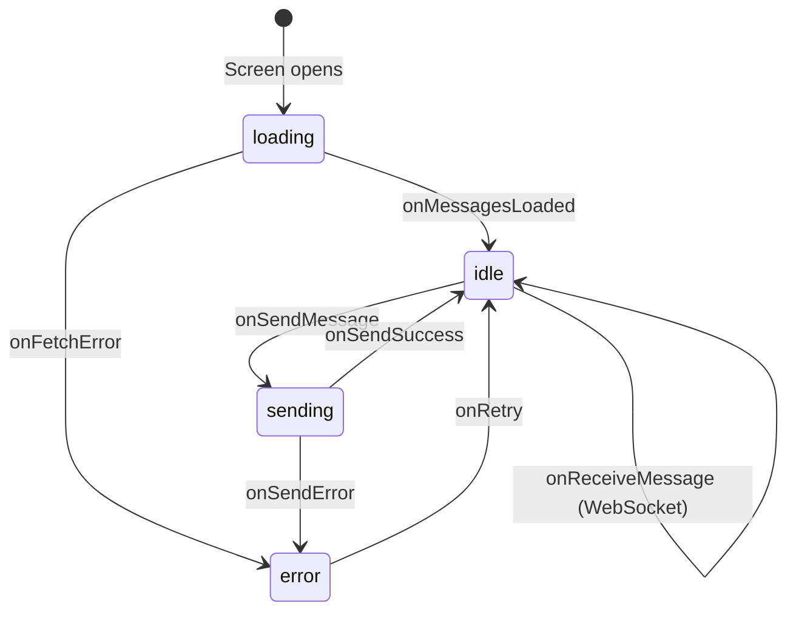

# FLRVI - State Machine Diagrams

**Objective:** This document provides detailed state machine diagrams for complex UI components and screens within the FLRVI application. These diagrams serve as a precise technical specification for frontend development.

---

## 1. Chat Screen State Machine

**Description:** This state machine models the behavior of the `ChatScreen`. It covers the various states the screen can be in, from loading initial messages to sending and receiving new ones.

**States:**
*   **`loading`**: The initial state when the screen is first opened and fetching the message history.
*   **`idle`**: The screen is ready and displaying the conversation. The user can interact with the input.
*   **`sending`**: The user has sent a message, and the app is waiting for a response from the API.
*   **`error`**: An error occurred while fetching or sending a message.

**Flowchart:**

### **State Transition Details:**

*   **`[*] -> loading`**: When the `ChatScreen` component mounts, it immediately enters the `loading` state and dispatches the `fetchMessages` thunk.
*   **`loading -> idle`**: Upon successful completion of the `fetchMessages` API call, the state transitions to `idle`. The UI displays the list of messages.
*   **`loading -> error`**: If the `fetchMessages` API call fails, the state transitions to `error`. The UI should display an error message with a "Retry" button.
*   **`idle -> sending`**: When the user sends a message, the app enters the `sending` state. The UI should optimistically display the new message in a "sending" state (e.g., slightly faded out).
*   **`sending -> idle`**: Upon successful completion of the `sendMessage` API call, the state returns to `idle`. The optimistically rendered message is updated to a "sent" state.
*   **`sending -> error`**: If the `sendMessage` API call fails, the state transitions to `error`. The optimistically rendered message should now show a "failed to send" indicator.
*   **`idle -> idle (onReceiveMessage)`**: When a new message is received via the WebSocket connection, the app remains in the `idle` state but appends the new message to the conversation list.
*   **`error -> idle`**: If the user taps the "Retry" button in the error state, the app transitions back to the `loading` or `sending` state to re-attempt the failed action.

---
