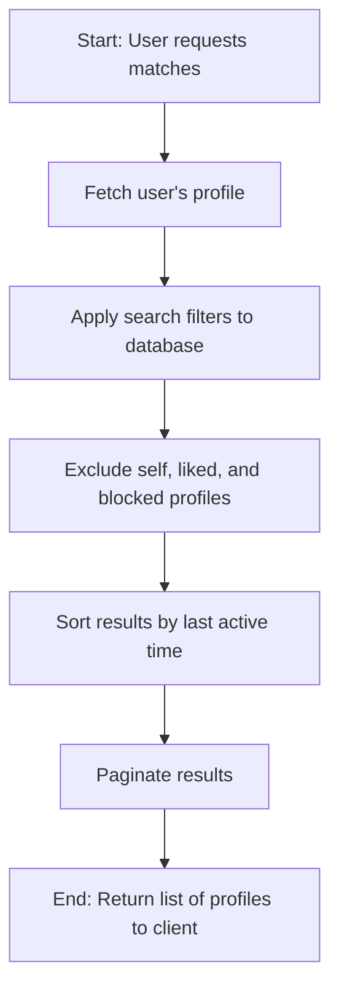

# FLRVI - Technical Architecture Overview (Detailed)

**Objective:** This document provides a detailed overview of the technical architecture for the FLRVI project. It is intended for developers to understand the structure of the codebase, the flow of data, and the core algorithms.

### 1. System Components

The FLRVI platform is composed of three main components:

1.  **Backend (MERN Stack):** A Node.js/Express.js server that provides a RESTful API for the mobile apps and the admin panel.
2.  **Database (MongoDB):** A NoSQL database that stores all application data, including users, profiles, and subscriptions.
3.  **Web Frontends:** Two simple web interfaces built with HTML, CSS, and JavaScript:
    *   **Pre-registration Landing Page:** A public-facing page for marketing and pre-registration.
    *   **Admin Panel:** A secure dashboard for application management.

### 2. Backend Architecture

The backend follows a standard Model-View-Controller (MVC) pattern, adapted for a REST API:

*   **`models/`:** Defines the Mongoose schemas for our database collections (`User`, `Profile`, `Subscription`). This is the data layer.
*   **`routes/`:** Defines the API endpoints (e.g., `/api/users`, `/api/profile`). This is the routing layer.
*   **`controllers/`:** Contains the business logic for each route. It processes requests, interacts with the models, and sends responses. This is the controller layer.
*   **`middleware/`:** Contains functions that run between the request and the controller. We use middleware for authentication (`auth.js`) and admin authorization (`admin.js`).
*   **`index.js`:** The main entry point for the application. It initializes the Express server, connects to the database, and wires up all the routes and middleware.

### 3. Core Algorithm: User Matching (MVP)

For the MVP, the user matching and discovery algorithm will be based on a straightforward combination of user-defined filters and recency.

**Algorithm Steps:**
1.  **Fetch Authenticated User's Profile:** Retrieve the profile of the user making the request to get their location and preferences.
2.  **Apply User-Defined Filters:**
    *   The API query will filter the `Profile` collection based on the filters provided by the user (e.g., `age`, `gender`, `location`, `interests`).
    *   The `location` filter will use a geospatial query if possible, or a case-insensitive text search as a fallback.
3.  **Exclude Certain Profiles:**
    *   The user's own profile will be excluded from the results.
    *   Any users that the current user has already "liked" or blocked will be excluded.
4.  **Sort the Results:** The filtered results will be sorted in descending order by the `last_active` timestamp (a field to be added to the `User` model). This ensures that the most recently active users appear first.
5.  **Pagination:** The final result set will be paginated to ensure fast load times and support infinite scrolling on the client.

**Flowchart:**


### 4. Authentication Flow (JWT)

Authentication is handled using JSON Web Tokens (JWT), which is a stateless and secure method for authenticating users.

**Flowchart:**
```mermaid
sequenceDiagram
    participant Client
    participant Server
    
    Client->>Server: POST /api/users/login (with email, password)
    Server->>Server: Verify credentials against database
    alt Credentials Valid
        Server->>Server: Generate JWT with user ID payload
        Server-->>Client: 200 OK (with JWT)
    else Credentials Invalid
        Server-->>Client: 400 Bad Request
    end

    Client->>Client: Store JWT (e.g., in localStorage)

    Note over Client, Server: For subsequent requests...

    Client->>Server: GET /api/profile/me (with 'x-auth-token' header containing JWT)
    Server->>Server: 'auth' middleware verifies JWT
    alt Token Valid
        Server->>Server: Process request
        Server-->>Client: 200 OK (with profile data)
    else Token Invalid
        Server-->>Client: 401 Unauthorized
    end
